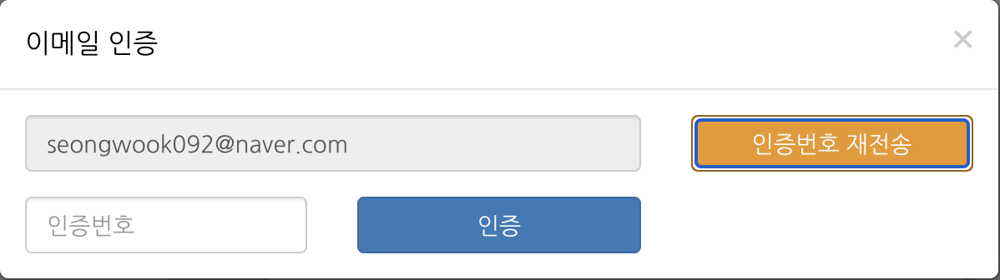
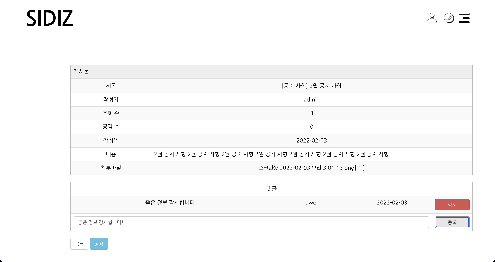

# Sidiz Team Project

## 1. 프로젝트 소개

- 의자 쇼핑몰 SIDIZ 사이트를 프론트 프로젝트로 리워크 하며 홈페이지 디자인을 좀 더 동적으로 바꾸면서 간단한 로그인, 회원가입, 장바구니, 결제창까지 넘어가는 기능을 구현했습니다.
- 호스팅 주소 : [http://sungwook6546.cafe24.com](http://sungwook6546.cafe24.com/)
   

## 2. 기능 소개

### 회원가입 페이지

- 이메일 인증으로 모달을 띄워서 API로 인증번호를 랜덤으로 4자리를 보내고 DB에 이메일과 인증번호의 값을 넣어둬서 인증이 되면 회원가입이 진행되게 만들었습니다.

    
  

- 이메일 인증 모달

    
  

- 주소 모달

    
   

### 장바구니 페이지

- 로그인 한 유저가 제품 페이지에서 제품을 장바구니에 담으면 수량과 그 제품에 대한 정보를 데이터베이스에 값을 넣도록 설계했습니다.
- 장바구니 페이지에서는 삭제와 주문하기만 기능만 가능하게 했습니다.
   

### 제품 비교하기

- 장바구니에 담은 제품들을 비교하기 페이지에 들어가면 그 제품에 해당하는 제품의 특징들을
비교할 수 있습니다.
   

### 주문 페이지

- 장바구니에서 주문하기 버튼 클릭 시 해당 유저가 선택한 제품의 목록을 그대로 주문하기 페이지로 받아와서 이용 약관의 모두 동의와 주문하는 유저의 정보를 모두 입력해야지 주문 완료로 넘어 가게 만들었습니다.
   

### 공지사항 페이지

- 게시판으로 관리자가 공지사항을 남길 수 있게 게시판을 만들었습니다.
- 공지사항은 작성자만 지우고 수정할 수 있게 만들었습니다.
- 댓글 기능과 공감 버튼 조회수 카운트 기능도 만들었고 댓글은 작성자만 삭제할 수 있습니다.
- 공지할 파일이 따로 있으면 파일 업로드를 하여 사용자가 다운로드 받을 수 있게 했습니다.
   

## 3. 사용 기술

    
   

## 4. 협업시 맡은 부분

- Back-end :
    - [ByeonSeongWook](https://github.com/ByeonSeongWook) : 장바구니, 비교하기, 로그인, 회원가입, 게시판
- Front-end :
    - [ByeonSeongWook](https://github.com/ByeonSeongWook) : 제품 페이지, 리뷰 페이지, 지점 찾기 페이지, 이벤트 페이지
    - [ssb4887](https://github.com/ssb4887) : 네비게이션, 장바구니 페이지, 주문 페이지, 브랜드 스토리 페이지, 뉴스 페이지,
                    비교하기 페이지, 장바구니 페이지
    - [ghdwn3103](https://github.com/ghdwn3103) : 메인 페이지, 디자인
    
   
## 5. 소요기간

- 21.12.29 ~ 22.01.20 (약 3주)
